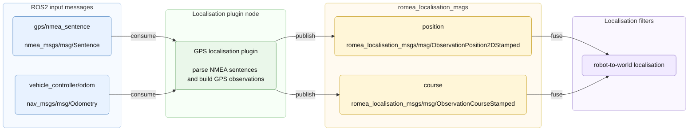

# romea_localisation_gps_plugin

`romea_localisation_gps_plugin` provides ROS2 localisation plugin nodes that convert GPS NMEA sentences into `romea_localisation_msgs` observations.

The package contains one plugin for single-antenna GPS receivers and one plugin for dual-antenna GPS receivers. Both plugins publish position observations from NMEA `GGA` sentences. The single-antenna plugin derives course observations from `RMC` track information, while the dual-antenna plugin derives course observations from `HDT` heading information.

Internally, the ROS2 components wrap the framework-independent GPS localisation plugins provided by `romea_core_localisation_gps`.

## 1) Concept

The GPS localisation plugin is an observation producer. It does not estimate the robot pose by itself. It converts GPS receiver data into localisation observations that are fused by the robot-to-world localisation filter.



The plugin uses a WGS84 geographic anchor to convert geodetic GPS fixes into a local ENU frame. This anchor is normally provided by the demo or robot localisation configuration.

## 2) Supported Plugins

| Executable | Component plugin | GPS mode |
| --- | --- | --- |
| `single_antenna_gps_localisation_plugin_node` | `romea::ros2::localisation::SingleAntennaGPSPlugin` | Single antenna |
| `dual_antenna_gps_localisation_plugin_node` | `romea::ros2::localisation::DualAntennaGPSPlugin` | Dual antenna |

The single-antenna plugin subscribes to vehicle odometry to determine whether the robot is moving forward or backward. This is needed to convert GPS track angle into robot course angle.

The dual-antenna plugin does not need vehicle odometry for course estimation because the heading is provided directly by the GPS receiver.

## 3) Input Topics

| Topic | Type | Use |
| --- | --- | --- |
| `gps/nmea_sentence` | `nmea_msgs/msg/Sentence` | NMEA sentence stream from the GPS driver |
| `vehicle_controller/odom` | `nav_msgs/msg/Odometry` | Vehicle odometry used by the single-antenna plugin to interpret track direction |

The NMEA parser uses:

| Sentence | Use |
| --- | --- |
| `GGA` | Position observation |
| `RMC` | Course observation for single-antenna GPS |
| `HDT` | Course observation for dual-antenna GPS |
| `GSV` | Satellite-view information used by diagnostics |

Other NMEA sentences can be added later if new GPS localisation observations or diagnostics need them.

## 4) Output Topics

| Topic | Type | Description |
| --- | --- | --- |
| `position` | `romea_localisation_msgs/msg/ObservationPosition2DStamped` | GPS position observation in the local ENU frame |
| `course` | `romea_localisation_msgs/msg/ObservationCourseStamped` | GPS course or heading observation |

In a robot application, these topics are usually remapped to robot-level localisation topics such as `/<robot_namespace>/localisation/position` and `/<robot_namespace>/localisation/course`.

## 5) Parameters

| Parameter | Type | Default | Description |
| --- | --- | --- | --- |
| `restamping` | bool | `false` | If true, observations are stamped with the node clock instead of the NMEA message stamp |
| `minimal_fix_quality` | int | `4` | Minimal accepted GPS fix quality |
| `minimal_speed_over_ground` | double | `0.8` | Minimal speed over ground required to publish course from a single-antenna GPS |
| `wgs84_anchor.latitude` | double | required | Latitude of the local ENU origin, in degrees |
| `wgs84_anchor.longitude` | double | required | Longitude of the local ENU origin, in degrees |
| `wgs84_anchor.altitude` | double | required | Altitude of the local ENU origin, in meters |
| `gps.gps_fix_uere` | double | required | User equivalent range error for GPS fix quality |
| `gps.dgps_fix_uere` | double | required | User equivalent range error for DGPS fix quality |
| `gps.float_rtk_fix_uere` | double | required | User equivalent range error for float RTK fix quality |
| `gps.rtk_fix_uere` | double | required | User equivalent range error for RTK fix quality |
| `gps.simulation_fix_uere` | double | required | User equivalent range error for simulated fixes |
| `gps.xyz` | double array | required | GPS antenna position in the localisation body frame, in meters |

Useful `minimal_fix_quality` values are:

| Value | Meaning |
| --- | --- |
| `2` | GPS fix |
| `3` | DGPS fix |
| `4` | RTK fix |
| `5` | Float RTK fix |

## 6) Configuration and Run

For a single-antenna GPS receiver:

```bash
ros2 run romea_localisation_gps_plugin single_antenna_gps_localisation_plugin_node \
  --ros-args --params-file path/to/gps_localisation_plugin.yaml
```

For a dual-antenna GPS receiver:

```bash
ros2 run romea_localisation_gps_plugin dual_antenna_gps_localisation_plugin_node \
  --ros-args --params-file path/to/gps_localisation_plugin.yaml
```

Example parameter file:

```yaml
gps_localisation_plugin:
  ros__parameters:
    restamping: false
    minimal_fix_quality: 4
    minimal_speed_over_ground: 0.5
    wgs84_anchor:
      latitude: 45.76345967
      longitude: 3.10955017
      altitude: 351.9
    gps:
      gps_fix_uere: 3.0
      dgps_fix_uere: 1.0
      float_rtk_fix_uere: 0.5
      rtk_fix_uere: 0.1
      simulation_fix_uere: 0.02
      xyz: [1.0, 0.0, 1.5]
```

## License

This project is released under the Apache License 2.0. See the `LICENSE` file for details.

## Authors

This package was developed by **Jean Laneurit**.
